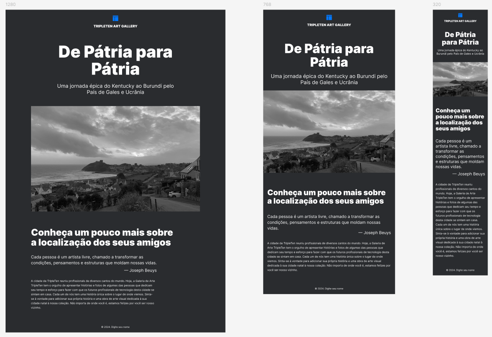

# TripleTen - Projeto Homeland

Este é um projeto da Tripleten Art Gallery - Homeland, destinado a profissionais compartilharem histórias e fotos de suas cidades natais, fazendo com que futuros profissionais de tecnologia se sintam em casa. O layout é responsivo, adaptando-se a diferentes tamanhos de tela, utilizando `unidades de medida relativas` e `media queries` para ajustar o design conforme os pontos de interrupção, garantindo que o layout permaneça intacto e não esteja quebrando.

## Tecnologias

- HTML5 semântico
- Metodologia BEM
- Flexbox
- Unidades de medidas relativas
- Media queries

## Descrição das Tecnologias e Técnicas Utilizadas

O `HTML semântico` foi aplicado para tornar o código mais compreensível, enquanto a `metodologia BEM` facilita a manutenção e a compreensão do código.

O `Flexbox` foi utilizado juntamente com `unidades de medidas relativas` para organizar e otimizar a responsividade do layout.

As `media queries` foram implementadas para ajustar o layout de acordo com os pontos de interrupção e garantir a responsividade em várias resoluções de tela. Foram adicionados dois pontos de interrupção para assegurar a responsividade, foram definidos com base em três intervalos:

- 320-768px (544px)
- 768-1280px (1024px)
- 1280px e acima

Para ver o projeto em execução clique <a href="https://vinimello90.github.io/web_project_homeland/">aqui</a>.

