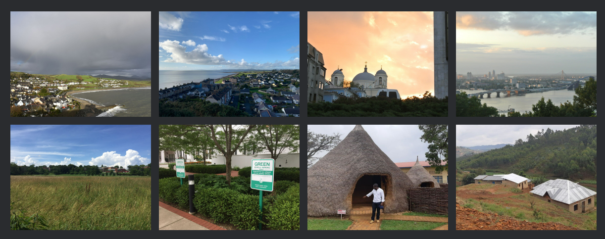
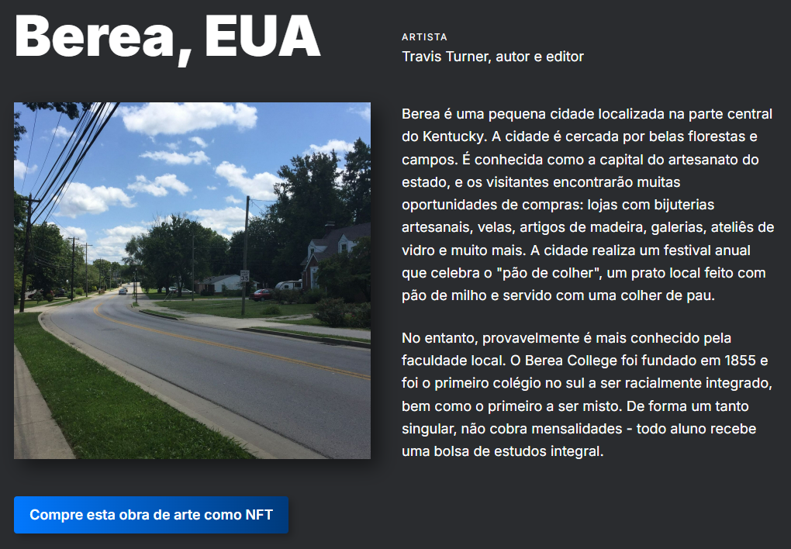
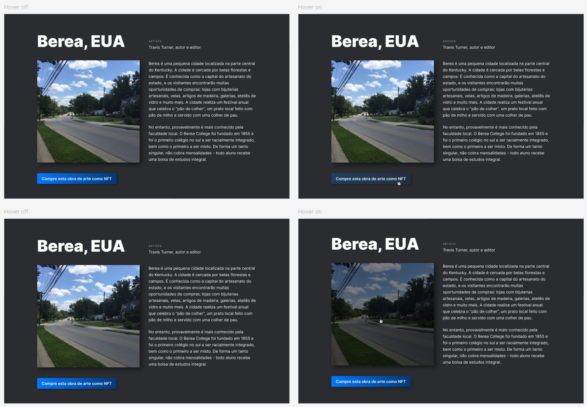
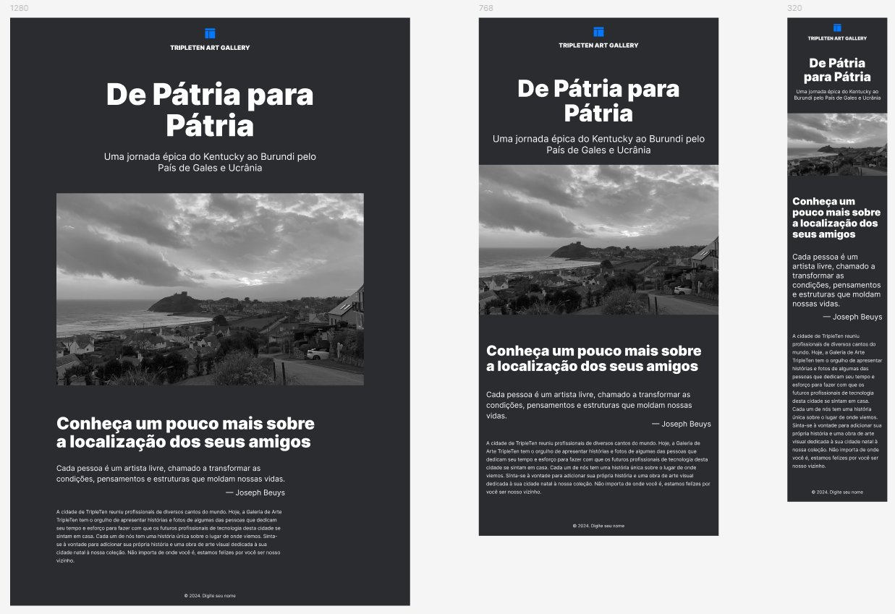

# TripleTen - Projeto Homeland

O **TripleTen - Projeto Homeland** é uma iniciativa da **Tripleten Art Gallery** que permite a profissionais compartilhar histórias e fotos de suas cidades natais. O objetivo é criar um ambiente acolhedor para futuros profissionais de tecnologia, fazendo-os se sentirem em casa.

Este projeto adota um layout responsivo, que se adapta a diferentes tamanhos de tela. Utiliza **unidades de medida relativas** e **media queries** para garantir que o design seja ajustado conforme os pontos de interrupção, mantendo o layout funcional e sem quebras.

**Veja o projeto em execução clicando [aqui](https://vinimello90.github.io/web_project_homeland/).**

## Tecnologias e Metodologias

- HTML5 semântico
- Metodologia BEM
- Flexbox
- Grid
- Hover
- Box-shadow
- Unidades de medida relativas
- Media queries

## Descrição das Tecnologias e Técnicas Utilizadas

### HTML Semântico

O **HTML semântico** foi utilizado para tornar o código mais legível e fácil de entender, facilitando a manutenção e a acessibilidade do projeto.

### Metodologia BEM

A **metodologia BEM** (Bloco, Elemento, Modificador) foi adotada para melhorar a organização e clareza no nomeamento das classes CSS, tornando o código mais escalável e fácil de manter.

### Flexbox

O `flexbox` foi empregado em conjunto com **unidades de medida relativas** para organizar e otimizar a responsividade do layout. Isso garante que os elementos se ajustem adequadamente às diferentes resoluções de tela.

### Grid

O `grid` foi utilizado nas seções de **photo-grid** e **places** para criar um layout mais estruturado e distribuído. A combinação com as **unidades de medida relativas** também contribui para a responsividade e a organização eficiente dos elementos nas telas de diferentes tamanhos.

- Seção **Photo-grid**

  

- Seção **Places**

  

### Hover e Box-shadow

A pseudo-classe `:hover` foi aplicada aos elementos interativos, permitindo alterações visuais quando o usuário passa o cursor sobre eles. Já o `box-shadow` foi utilizado para adicionar profundidade aos elementos, criando um efeito de sombra e destacando itens importantes da interface.

  

### Media Queries

As **media queries** foram implementadas para ajustar o layout conforme os pontos de interrupção, garantindo a responsividade em diversas resoluções de tela. Os seguintes intervalos de resolução foram definidos:

- 320-768px (com ponto de interrupção em 544px)
- 768-1280px (com ponto de interrupção em 1024px)
- 1280px e acima
  

## Planos de Melhoria

- Adicionar vídeos das cidades para complementar as fotos e tornar o conteúdo ainda mais interativo e dinâmico.
